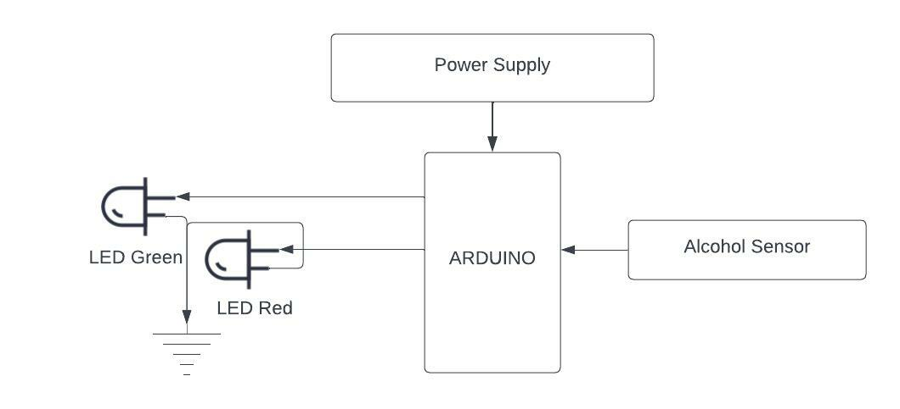

# Anti Drunk Car Alert System

In this project, we will be using a Arduino to detect the alcohol level in the driver's breath and alert the driver if the alcohol level is above the limit. We will be using a MQ-3 sensor to detect the alcohol level in the breath. The MQ-3 sensor is a gas sensor that can detect the alcohol level in the breath. The MQ-3 sensor is connected to the Arduino and the Arduino is connected to RED and GREEN LED. The RED LED will be turned on if the alcohol level is above the limit and the GREEN LED will be turned on if the alcohol level is below the limit.

